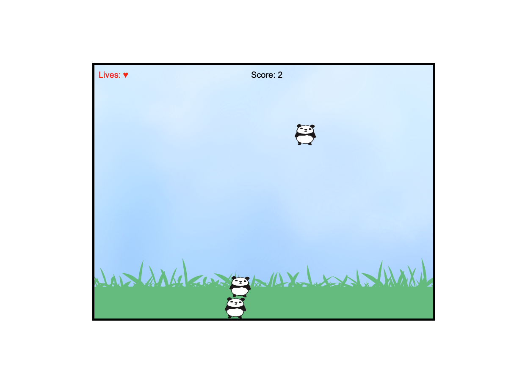

# Panda Stack
A fun stacking game built with JavaScript and HTML5 Canvas. Stack cute pandas as high as you can!  
- **Live Demo:** [https://gvnghiem.github.io/panda-stack/](https://gvnghiem.github.io/panda-stack/)
- **Features:** 3 lives, score counter, border wrapping, dynamic view shifting.
- **Controls:** Arrow keys to move the falling panda.


# Panda Stack

A fun and engaging stacking game built with JavaScript, HTML5 Canvas, and the Audio API. Stack cute pandas as high as you can while avoiding misses! The game features a dynamic sky and grass background, sound effects, and smooth gameplay mechanics.


## Features
- **Gameplay:** Guide falling pandas to stack on top of each other using arrow keys. Stack successfully to increase your score, but miss three times and it’s game over!
- **Controls:** 
  - Left Arrow: Move panda left.
  - Right Arrow: Move panda right.
- **Visuals:**
  - Stretched sky background (`sky.png`) that shifts downward as the stack grows.
  - Grass layer (`grass.png`) at the bottom, moving with the camera.
  - Cute panda sprite (`panda.png`) for the stacking objects.
- **Sound Effects:**
  - `drop.mp3`: Plays when a panda stacks successfully.
  - `error.mp3`: Plays when a panda misses and hits the ground.
  - `press.mp3`: Plays when moving the panda left or right.
- **Mechanics:**
  - Border wrapping: Pandas wrap around the left and right edges of the canvas.
  - Camera shift: View shifts down by one panda height (50px) when the stack exceeds 50% of the screen height (300px) and increases in height.
  - Collision: Pandas only stack on top contact; side collisions fall past without stacking.

## Screenshots
 <!-- Add a screenshot if you have one -->

## Setup Instructions
1. **Clone the Repository:**
   ```bash
   git clone https://github.com/gvnghiem/panda-stack.git
   cd panda-stack

Credits
Built with JavaScript, HTML5 Canvas, and the Audio API by gvnghiem.

Sound Effects: error.mp3, drop.mp3, and press.mp3 sourced from [101 Soundboards](https://www.101soundboards.com/). 

Images (panda.png, grass.png, sky.png) sourced by [openclipart.org](https://openclipart.org/).

